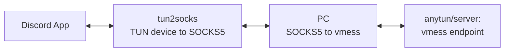
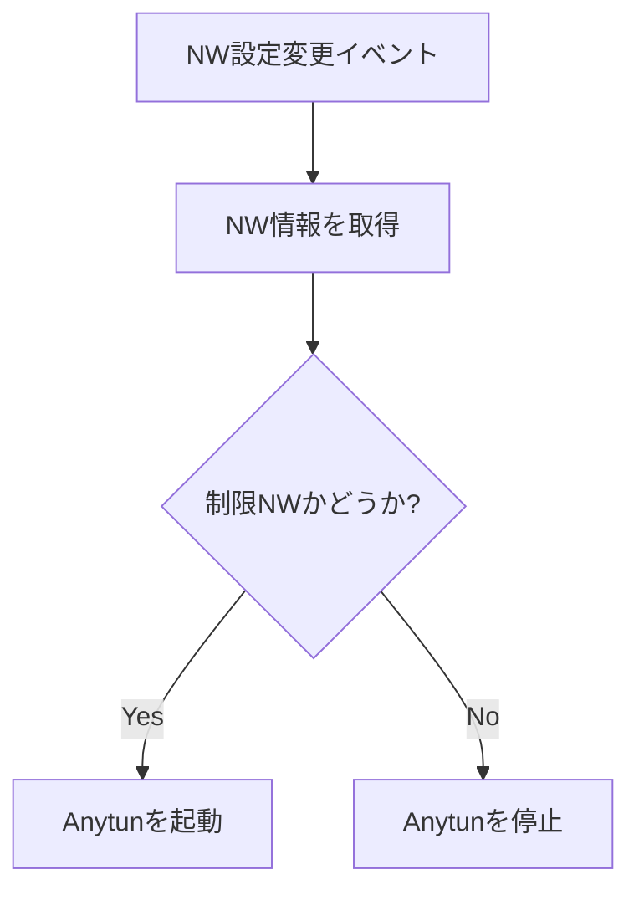
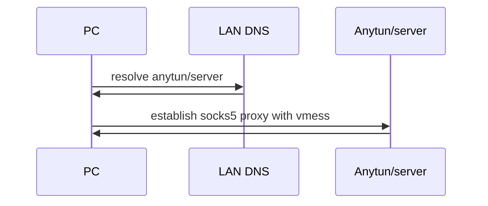
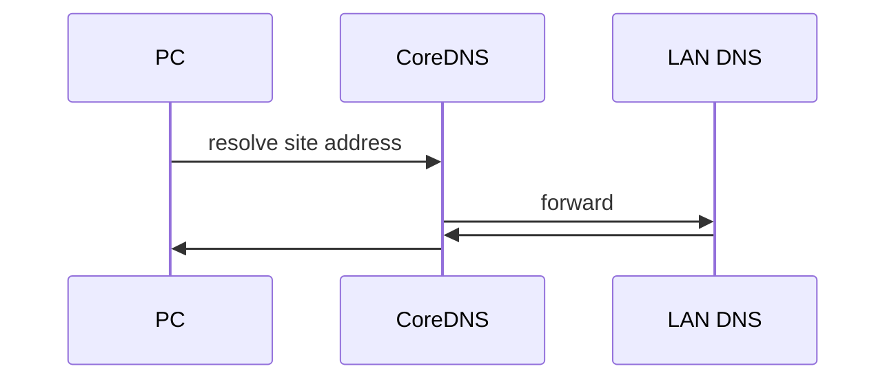
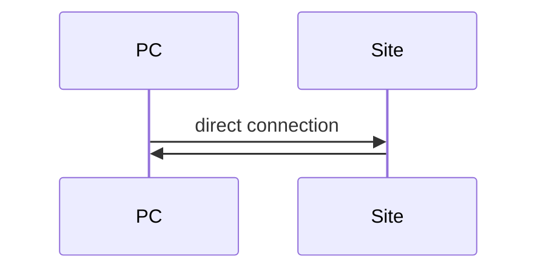
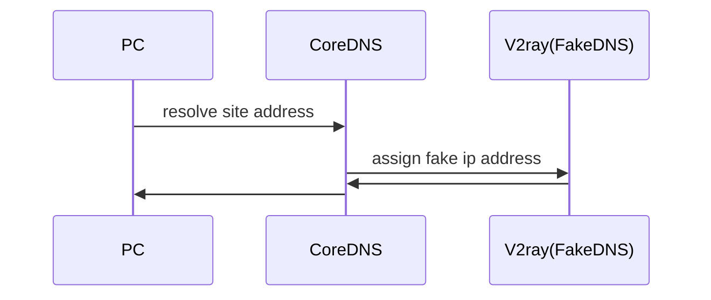
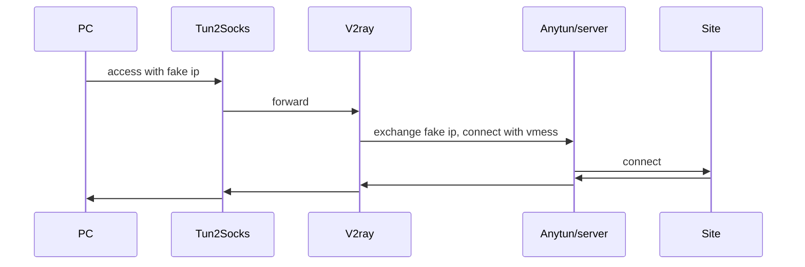

# Anytun

制限の厳しい大学内LANでDiscordやTwitterを動作させるためのソフトウェア 

# インストール方法

## Windows

整備中

## Mac

homebrew 
```
brew tap aaaa777/tap
brew install anytun
```

# Config

配置場所は以下にする予定
Mac: `/usr/local/etc/anytun/` 
Windows: `C:\"Program Files(x86)"\Anytun\` 

# Usage

整備中 
クライアントはwinget, brew, aptでインストール可能にし、サーバーはdockerhubからプルできるようにする 

# TODO

カテゴリ毎に上から優先順位高め

### architecture
- [x] Windows(amd64)対応 
- [x] Mac(Apple Silicon)対応 
- [ ] Mac(Intel)対応 
- [ ] Windows(arm64)対応 
- [ ] Linux対応

### installer
- [x] InnoSetupインストール対応 
- [x] Tarball化スクリプト作成 
- [ ] homebrewインストール対応 
- [ ] WinGetインストール対応 

### document
- [ ] インストール方法の記述 
- [ ] READMEの整備

### feature
- [ ] v2rayのロードバランス実装 
- [ ] 有効エンドポイントリストの自動ダウンロード 

# 要件

サーバーサイド
- docker-compose
- 独自ドメイン

クライアント
- Windows or MacOS

# ディレクトリ構造

server: サーバーサイド
client: クライアントサイド
client/configs: クライアントのデフォルト設定

# 概念図

### 接続フロー


### トリガー

Macの場合、特定のドメインに対しての応答を利用してCisco Umbrellaを利用しているか検知する。
Windowsの場合、ネットワーク設定が変更されたイベントをトリガーにして、以下のネットワークチェックシーケンスを実行する。

### ネットワークチェックシーケンス



### 接続シーケンスについて

任意のサイトにアクセスする際、以下のシーケンスで接続を行う。


### 接続シーケンスv1 (v2ray)

現在は使われていないが、手動のプロキシ設定で利用することは可能



### 接続シーケンスv2 (tun2socks + v2ray)

現在のデフォルトの接続方法

#### 通常の接続時(踏み台サーバ含む)

DNS


TCP/UDP


#### 回避サイトへの接続時

DNS


TCP/UDP

